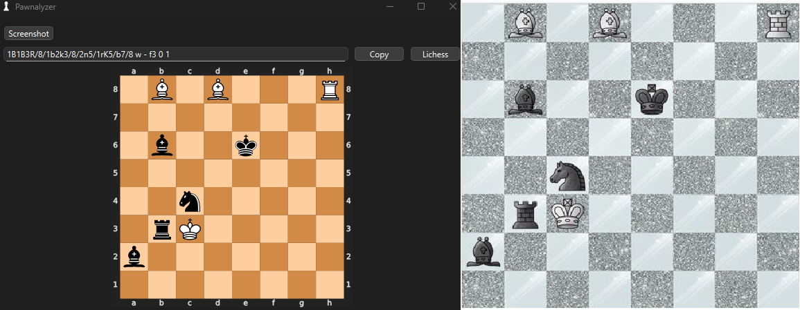
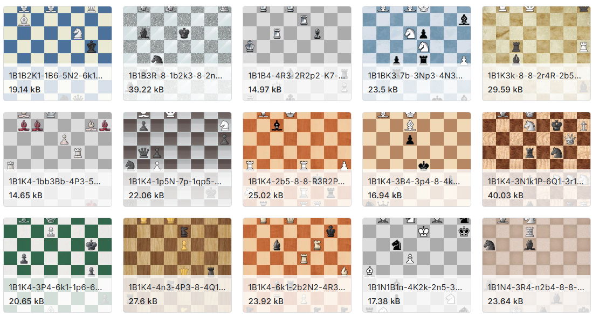

# ImagePawn

> **Convert any on‑screen chessboard into a ready‑to‑use FEN string—in a single click.**

Whether you’re analysing a screenshot from social media, a live broadcast, or a training video, ImagePawn extracts the complete FEN in one click.
Running on mobilenetv3 which can achieve real-time speed inference.

* **Desktop app** with screenshot capture, FEN preview, and direct Lichess integration  
* **CLI script** for lightning‑fast FEN extraction from image files  
* **Training script** to build or fine‑tune your own model on synthetic data  

The goal: make board analysis as fast and flexible as possible—especially for content shared online.



---

## Project Structure
```
imagepawn/
├── app/                 # End‑user application
│   ├── app.py           # PyQt6 GUI (Pawnalyzer)
│   ├── inference.py     # Stand‑alone inference script
│   └── models/
│       └── best.pt      # Pre‑trained MobileNetV3 checkpoint
└── training/            # Training pipeline
    ├── dataset/         # Synthetic images & labels (placeholder)
    ├── checkpoints/     # Saved checkpoints
    └── train.py         # End‑to‑end training entry point
```

## Getting Started

### Prerequisites

* Python ≥ 3.9  
* PyTorch ≥ 2.0 (GPU optional)  
* Pillow, torchvision, PyQt6, python‑chess, etc. – see `requirements.txt`

### Installation

```bash
# clone
$ git clone https://github.com/maaaakks/imagepawn.git
$ cd imagepawn

# install dependencies (virtual‑env recommended)
$ pip install -r requirements.txt
```

---

## Usage

### GUI App

```bash
$ cd app
$ python app.py
```

| Feature | Description |
|---------|-------------|
| **Screenshot** | Select any chessboard with **Win + Shift + S** (or the in‑app **Screenshot** button). The predicted FEN appears in the UI and is automatically copied to your clipboard. |
| **SVG Preview** | Scalable vector preview lets you double‑check the position before sharing. |
| **One‑click Lichess** | Opens the current FEN in the Lichess editor so you can explore variations immediately. |

**Note**: 

In the training dataset, many positions lack any indication of whose turn it is (white or black), so the model tends to default to White’s move.
Fortunately, this is easy to work around.

Lichess allows you to switch the side to move directly in the editor, and you can also manually change the “w” to “b” in the FEN string.
Accurately detecting the side to move was a potential area for improvement, but it's tricky to implement with high precision, so it’s not a priority for now.

### CLI Inference

```bash
$ cd app
$ python inference.py path/to/board.jpg [optional/path/to/model.pt]
```

The script outputs the full FEN string and exits.

### Training

```bash
$ cd training
$ python train.py [optional/path/to/checkpoint.pt]
```

Hyperparameters are on the top of `train.py`.
You can custom batch size, learning rate, augmentation flags, and more.

### Dataset



To keep the repository lightweight, the training dataset is **not** included.
You can download it from Kaggle (CC0 license):

| | Description |
|---|---|
| **Name** | Chess‑Positions |
| **Size** | 100 000 PNG files (≈ 3 GB) |
| **License** | [CC0 – Public Domain](https://creativecommons.org/publicdomain/zero/1.0/) |
| **Download** | <https://www.kaggle.com/datasets/koryakinp/chess-positions> |

The dataset contains 100,000 images of randomly generated chess positions, with each file named using its corresponding FEN code.
No extra metadata required.

---

## Performance

| Metric | Result |
|--------|--------|
| **Epoch** | 5 |
| **Training time** | 15mn - RTX 4070 |
| **Full‑board accuracy** | 98.70 % (validation) |
| **Loss** | 0.0004 |

>FullBoard accuracy is the percentage of test examples where the model predicted the entire board layout 100% correctly.

### Why so high?

* Synthetic, perfectly labelled data means zero annotation noise.  
* Pre‑trained ImageNet backbone accelerates convergence.  
* The classification task is well‑posed.

>I think the training pipeline could be optimized, but this high score is good enough for me at the moment and meets my current needs.

---

## Data Augmentation & Limitations

* **Arrows & Highlights**: Social media boards often include arrows or highlights to show the last move or the idea behind the position. These arrows can significantly reduce the model's precision, so we integrated them as a form of data augmentation in our dataset. Resulting in very high accuracy, even in real-world cases.
* **Side‑to‑Move Ambiguity**: Some positions don't specify whose turn it is, so the model defaults to White. You can flip the turn manually if needed in the FEN code or in the Lichess interface.
* **Real‑World Photos**: This model isn't trained to predict FEN codes from real-world scenes, but it's robust across most popular online chess platforms (Lichess, Chess.com, etc.).

---

## What next ?

I'm working on a live mode feature that lets users select an area on the screen to be analyzed every 0.x seconds, along with real-time evaluation of the position—centipawn score and best move—using the Stockfish library.

However, since this feature could potentially be misused and doesn't align with the core purpose of the project which is analyzing chess positions from social media images and enabling quick interaction to test certain moves. I’ve decided to remove these components from the initial 0.1 release.

---

## License

MIT © 2025

Feature requests, and pull requests are warmly encouraged.
